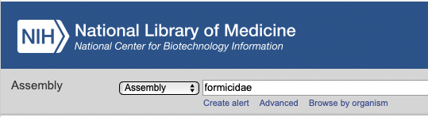
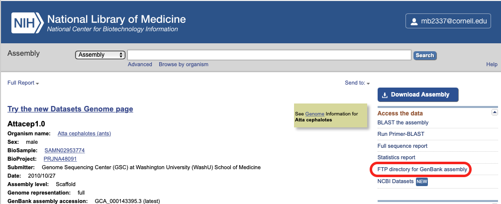

```{r setup, include=FALSE}
knitr::opts_chunk$set(echo = TRUE)
```

## Introduction
We have two big goals for our time working together:

1. Running comparative genomics analyses to understand how genes related to traits we are interested are evolving across ants. 
2. To learn the computational and bioinformatic skills that will make those analyses possible. 

## Getting started with Bash
You will be using a lot of different programs in your project: Orthofinder, BUSTED-PH, RELAX, and maybe others. In order to use those tools effectively, you'll need to become comfortable with Bash scripting. Today, we will practice by working on a script to download ant genomes. 

### Finding genomes to download
We will need to download all the ant genomes we can find, in order to use them in our comparative genomic analyses. That means we need to find them in publically available repositories, like the NCBI databases. 

It's important to understand the kind of data we want here. What we're looking for probably won't be referred to as a "genome"- that would be the sequence of all the DNA in an organism, both coding DNA that can be translated to proteins, and noncoding DNA. We only want gene sequences for our project, so we'll be looking for things like "official gene sets" or "CDS sequences". We can find these datasets through the [NCBI Assembly database](https://www.ncbi.nlm.nih.gov/assembly/).



<details>
  <summary>When you search for ant (Formicidae) assemblies, how many results do you get?</summary>
  
  You should get 78 results. 

</details>


### Manual downloading vs. scripting
Now, we could click through and download all of these by hand. However, that would be both (1) REALLY tedious and (2) Not reproducible- we would have no record of what exactly we downloaded, and the search results might change in the future! So, writing a Bash script is going to be a better approach. 

### Housekeeping and setup 
Whenever you're coding, you want to make sure you're doing everything from inside the directory/repository that corresponds to your project. 

<details>
  <summary>How do you check which directory you're in, using the command line?</summary>
  
  Use the command `pwd`.
  
  ```{bash, engine.opts='-l'}
  pwd
  ```

</details>

If you aren't inside the correct directory, use `cd` to get there. 

### How to download files with Bash commands?
One of the most important skills in coding is understanding how to find help when you need it- that means lots of Googling and consulting with sites like StackOverflow. When I'm deep in a coding project, I probably do this tens to hundreds of times a day! We'll start practicing that now. 

<details>
  <summary>Using Google, what do you think is the Bash command to download a file from the Internet?</summary>
  
  ##### Downloading files
  I usually use the command `wget`, which is a free utility for non-interactive download of files from the Web. 
  
  The syntax for `wget` is `wget [options] [url of the file you want to download]`.
  
  One option you'll probably want to use is `-O`, which allows you to specify the filename that you want to save your download to. 
  
  Learn more [here](https://www.shell-tips.com/bash/download-files-from-shell/#gsc.tab=0).

</details>

<details>
  <summary>Let's practice.</summary>
  
  ##### Downloading a file
  From the command line, what happens if you run the code `wget https://www.moreaulab.entomology.cornell.edu/files/2022/09/Moreau-Lab-Fall-2022-1536x850.png`?

</details>

<details>
  <summary>How would you download that file to a specific name?</summary>
  
  ##### Downloading a file
  You should use the code `wget -O moreaulab.png https://www.moreaulab.entomology.cornell.edu/files/2022/09/Moreau-Lab-Fall-2022-1536x850.png`.

</details>

##### Finding URLs for genome assemblies
So clearly, to download files with Bash commands, we need to know the URL of that particular file online. Luckily, NCBI will supply this for you! On the page for a particular genome assembly, look for the link "FTP directory for RefSeq Assembly" (the best version of the assembly, but not all species have this) or "FTP directory for GenBank Assembly". 



<details>
  <summary>After clicking that link, which of the files do you think we want to download?</summary>
  
  Ideally, we want the file that has "cds" in the filename, something like `GCF_003672135.1_Obir_v5.4_cds_from_genomic.fna.gz`. 
  
  Not all species will have this; sometimes that means we'll have to poke around for a different file, and something that means the genes for a species aren't publically available yet, so we won't use it in our project. 
  
  So, if you right-click and copy the link for the dataset that we want, we can download it with `wget`. 

</details>


<details>
  <summary>What code will you use to download a genome and send it to a specific filename? What happens when you run it?</summary>
  
  Your code should look like `wget -O genome.fna.gz https://ftp.ncbi.nlm.nih.gov/genomes/all/GCF/003/672/135/GCF_003672135.1_Obir_v5.4/GCF_003672135.1_Obir_v5.4_cds_from_genomic.fna.gz` 
  
  When you run that code, you'll get a file called `genome.fna.gz` in your working directory, containing gene sequences for your species!

</details>

### Turning Bash commands into Bash scripts
Now, we could run `wget` 78 times for all the ant genome assemblies on NBCI, but that would be just as inefficient, error-prone and nonreproducible as clicking a button. What we need to do is turn our simple `wget` command into a Bash script, which we can use any time we want to download a batch of genomes. 

#### Writing a simple script
Writing a Bash script is pretty straightforward! All you need is a text editor and an idea of what you want your script to do. For text editors, I really like [Atom](https://github.com/atom/atom/releases/tag/v1.60.0), which you can download now. 

Once you have Atom or another text editor installed and opened up, we can start writing our script. The first line of every Bash script must be `#!/bin/bash`. This tells your computer where to find the program, Bash, which it will use to run the instructions in your script. 

After that, you can add whatever code and comments you want to your script. Let's start with something simple:

```
#!/bin/bash

echo "Hello World"
```

Add this to your script file, and save it with the name `helloScript`. 

Now, before we can run our script, we have to make it "executable". This just means giving the computer permission to "execute", or run, the contents of the file. We can do this with the command `chmod u+rwx helloScript`. You can learn more about the `chmod` command [here](https://www.computerhope.com/unix/uchmod.htm), if you're interested. 

Now, we can run our script and see what happens! On the command line, just type the path to and name of our script: `./helloWorld`.

+ The `./` means the script file is located in our current, working directory. 
+ `helloWorld` is, of course, the name of the script file. 

<details>
  <summary>What output do you get when you run the helloWorld script?</summary>
  
  The shell should print out `Hello World`. 

</details>

So this shows us that `echo` is a Bash command that prints out text, in this case the text "Hello World". 

#### Writing a script to download genomes
We've got a basic script that prints the text "Hello world". Now let's make something a little more useful:

1. Open a new file in Atom
2. Add the required first line for a Bash script, `#!/bin/bash`
3. Save it with a meaningful name that tells you what the script does
4. Via the command line, make the script executable with `chmod`

**Now would also be a great time to make sure our script is up on Github!**

When writing a script, I think it's easiest to start small and then build big. In other words, start with the most simple version of the task you want to accomplish: in this case, downloading a bunch of genomes. 

<details>
  <summary>What's the simplest version of this task, in words and in code?</summary>
  
  Downloading just **one** genome is the simplest version of downloading a bunch of genomes. 
  
  The code for this would be something like what we did before:
  `wget -O genome.fna.gz https://ftp.ncbi.nlm.nih.gov/genomes/all/GCF/003/672/135/GCF_003672135.1_Obir_v5.4/GCF_003672135.1_Obir_v5.4_cds_from_genomic.fna.gz`

</details>

#### Doing the same task many times, with Bash
Once we've written the code for a mini-version of our bigger task, we can build up. Now that we know how to download one genome, we can think about how to download several genomes. 

Often a really good way to do this with Bash code is with something called a **loop**. Loops let us feed some input into a series of commands and keep re-running them until a particular condition is reached. They are useful for automating repetitive tasks.

<details>
  <summary>What different kind of loop exist in Bash? Use Google to find an answer.</summary>
  
  Bash has three basic kinds of loops:
  
  1. For loops
  2. While loops
  3. Until loops
  
  Each loop is different because it will stop running based on a different kind of final condition. 

</details>

Loops will run over and over until a final condition is satisfied. 

<details>
  <summary>What final conditions satisfy each kind of loop? Use Google to find an answer.</summary>
  
  1. For loops run code **for** each element of a list, and stop once there are no list elements remaining. 
  
  ```{bash, engine.opts='-l'}
  # Create a list of names
  names='Mahalia Megan Seyde'
  # For each name in the list
  for name in $names
  # Print the name
  do
    echo $name
  done
  echo All done
  ```
  
2. While loops run code **while** some condition remains TRUE. For example, keep printing numbers, starting at zero, as long as the last number you printed is less than ten. 

  ```{bash, engine.opts='-l'}
  # Start a counter at 1
  counter=1
  # While the counter is less than or equal to 10 (that's what -le means)
  while [ $counter -le 10 ]
  do
  # Tell us the current value of the counter
  echo $counter
  # And increase the value of the counter by 1
  ((counter++))
  done
  echo All done
  ```

3. Until loops run code **UNTIL** some condition becomes TRUE. For example, keep printing numbers, starting at zero, until the last number you printed is equal to ten. 
  ```{bash, engine.opts='-l'}
  # Start a counter at 1
  counter=1
  # Until the counter is greater than 10,
  until [ $counter -gt 10 ]
  do
  # Print the current counter value
  echo $counter
  # And increase the counter value by 1. 
  ((counter++))
  done
  echo All done
  ```

</details>

We want to download a whole bunch of genome assemblies using `wget`. What kind of loop do you think makes the most sense here? Think about their conditions. 
<details>
  <summary>What kind of loop could we use to download our genomes? If you're feeling stuck, try using Google and StackOverflow.</summary>
  
  I would actually use a while loop, to read each line of a list of genomes and download them til there are no more lines of the file left. You could also write this as an until loop.
  
  To learn more, check out [this StackOverflow answer](https://stackoverflow.com/questions/1521462/looping-through-the-content-of-a-file-in-bash).

</details>

Keep in mind **there is no wrong answer**. As long as your code does what you want, and other people can understand how it's doing that, you're good to go! What makes sense to me might not be the most obvious answer to you, and that's ok. We can use comments in our code to help other people understand our reasoning. 

Now we can start writing the code to build up from our single, simple task to the bigger goal we want to accomplish. 

<details>
  <summary>What is the basic syntax of a Bash while loop? Use Google.</summary>
  The basic syntax is:
  
  ```
  while [ condition ]
  do
   command1
   command2
   command3
  done
  ```
  
  So, we need to figure out the right condition and think about what commands we want to run.
</details>


##### How would we write a while loop to iterate over a list of genomes and download them? 
This is a good time to turn to Google. We could do a ton of research, learning a lot in depth about while loops and different Bash commands- but it's probably more efficient to see if anyone else has figured out a good solution for how to **iterate over lines of a file with Bash**. 

<details>
  <summary>What do you find if you Google this problem?</summary>
  I found a couple of answers that look useful:
  
  + [This StackOverflow question and it's answers](https://stackoverflow.com/questions/1521462/looping-through-the-content-of-a-file-in-bash)
+ [This post has some ideas](https://www.baeldung.com/linux/bash-loop-file-content)
+ [This post](https://codefather.tech/blog/bash-loop-through-lines-file/) suggests using a for loop, demonstrating that there are always multiple ways to do this same thing!
  
</details>

#### Putting the pieces together in a script
So we've decided to use a while loop to read through the lines of a file that lists genome URLs and download the URL on each line. 

Let's turn that verbal description of what we want to do into a Bash script. 

<details>
  <summary>What does your script look like?</summary>
  This is what I would do:
  
  ```
  #!/bin/bash
  
  while read -r line;
  do
    wget $line
  done < genomeURLs.txt
  ```
  
  Let's make sure we understand the structure of what we did. We'll actually start at the bottom, where the code `done < genomeURLs.txt` is feeding our URLs file into the while loop. Then, jumping to the top, `while read -r line` is reading in each individual line of the URLs file. Inside the loop, `wget $line` is using `wget` to download whatever information is on the current line. This will continue until there are no more lines left in the file.
</details>

Now we can put together a file listing genome assembly URLs and test our script. 

### Bash and variables
With our simple script, the genome assemblies got downloaded to files with pretty clunky names- `https://ftp.ncbi.nlm.nih.gov/genomes/all/GCF/003/672/135/GCF_003672135.1_Obir_v5.4/GCF_003672135.1_Obir_v5.4_cds_from_genomic.fna.gz` got downloaded to something called `GCF_003672135.1_Obir_v5.4_cds_from_genomic.fna.gz`, for example. 

That's annoying for two reasons. One, those names aren't super human-readable, so it might be hard to remember which file corresponds to which species. Second, the names aren't necessarily formatted consistently across different species, so it might be hard to work with those files in batches in the future. 

<details>
  <summary>What option could we add to our `wget` command to solve this problem?</summary>
  
  We can use the option `-O` with our `wget` command, to specific a file name for each download.
  
</details>

Now the question becomes, how do we give each genome a different name? We can do this with **Bash variables**.

A variable is a temporary way to store a piece of information and use it in a script. There are two things you can do with variables: set their value and read their value (i.e. create and use them). 

Variable values can be **set** in a number of ways: you might directly assign them, or they might get assigned as the result of some processing done by your script. To directly assign a variable in your script, use the syntax `export [variable name]=[variable value]`, with backticks (   \`   ) around any code used in the variable value. So for instance, to create a variable that stores your current working directory, you might use the command:
```
export test=`pwd`
```

Formatting is important. Note there is no space on either side of the equals ( = ) sign. We also leave off the $ sign from the beginning of the variable name when setting it.

To **read** a variable's value and use it in a script, just type the variable name after a `$`. 

<details>
  <summary>Knowing that variable names are preceded by a `$` when in use, what variable did we use in our simple script earlier?</summary>
  
  We can see that we had a variable called `$line` in our script.
  
</details>

It's often useful to print the value of your variable to the command line, so you can check that it is storing the correct information. You can do this with the command `echo`, which prints out whatever information is after the command. Let's try that with our script, editing it to include `echo $line`:

```
  #!/bin/bash
  
  while read -r line;
  do
    echo $line
    wget $line
  done < genomeURLs.txt
  ```
  
<details>
  <summary>What information is being stored in $line?</summary>
  
  As our script loops through each line of genomeURLs.txt, `$line` stores the value of the line.
  ```{bash, engine.opts='-l'}
  # While reading each line of the file:
      while read -r line;
      do
        # Echo the value of $line
        echo $line
        #wget $line
      done < genomeURLs.txt
  ```
  
</details>


#### Setting up variables in our script
Now let's think about how we can read information from our input file and assign it to variables in order to download each genome assembly to a sensibly-named file.

One simple way is to add a second piece of information to our URLs file, giving each species' genome assembly a unique identifier. I like to use the first letter of the genus and first three letters of the species name for this (so *Atta cephalotes* becomes acep). Go ahead and edit the URLs input file so that each line has the URL, then the species identifier, separated from one another by a comma. 

Let's check what's stored in the `$line` variable now. Edit your script, commenting out the `wget` command for now, to look like this:

```
  # While reading each line of the file:
      while read -r line;
      do
        # Echo the value of $line
        echo $line
        #wget $line
      done < genomeURLs.txt
  ```
  
<details>
  <summary>What information is being stored in $line now?</summary>
  
   Now each line has both the URL and a species code, and looks like 
   ```
   https://ftp.ncbi.nlm.nih.gov/genomes/all/GCF/000/204/515/GCF_000204515.1_Aech_3.9/GCF_000204515.1_Aech_3.9_cds_from_genomic.fna.gz,aech
   ```
  
</details>

Now, as our script reads each line of the input file, we can extract out the URLs and species codes and assign them to variables, so that we can both download the genome assembly, and give it a nice name. 

So, how to extract those two pieces of information? Currently, both are stored TOGETHER in `$line`. We can use some text manipulating commands to extract each piece and assign it to its own variable.

<details>
  <summary>There are a lot of ways to do this. What do you find when you Google "extracting a piece of a text string with Bash"?</summary>
  
   Here are some useful links:
   
+ [Some of these StackOverflow answers](https://stackoverflow.com/questions/428109/extract-substring-in-bash) could be useful.
+ [Another Stack overflow example](https://stackoverflow.com/questions/16040567/use-awk-to-extract-substring)
+ [This is also a great overview](https://www.baeldung.com/linux/bash-substring)
  
  
</details>

This is another example of a task that can be accomplished in a LOT of different ways. 

<details>
  <summary>This is what I would do.</summary>
  
   To extract the first chunk of information, the URL, I used the code:
   
   ```
   export transcriptUrl=`echo "$line" | awk -F',' '{print $1}'`
   ```
   
  This code echoes the value of `$line`, passes that information with a pipe command (   `|`   ) to `awk`, which splits up `$line` at the commas, and then finally prints out the first chunk that is produced. That data is assigned to the variable `$transcriptUrl`.
  
  Then to get the second piece of information, the species code, I used the code:
  
  ```
  export speciesCode=`echo "$line" | awk -F',' '{print $2}'`
  ```
  
  Can you tell what this code is doing?
</details>

Now we have extracted the URL and the species code into variables- great! Now we need to **use** those variables in our script. 

<details>
  <summary>How would you edit your script to use $transcriptUrl to download the genome assemblies? </summary>
  
  Instead of using `wget` to download the value of `$line`, now we use `wget` to download the value of `$genomeUrl`:
  
   ```
  # While reading each line of the file:
      while read -r line;
      do
        # Echo the value of $line
        echo $line
        # Create the transcriptUrl variable:
        export transcriptUrl=`echo "$line" | awk -F',' '{print $1}'`
        
        # Create the speciesCode variable
        export speciesCode=`echo "$line" | awk -F',' '{print $2}'`
        
        # Download the genome assembly, whose URL is stored in transcriptUrl:
        wget $transcriptUrl
      done < genomeURLs.txt
  ```
   
</details>

We have one last task to accomplish: downloading the genome assemblies to nicely named files. We have a species code, stored in `$speciesCode`, but that's not really enough- we don't want our genome assemblies to just be called `aech`, `acep`, etc.! We should construct a nicer name, maybe something like `aech_genomeAssembly.fna.gz`. 

<details>
  <summary>Can you create a variable that stores this nicer name? </summary>
  
  You can do this with the code:
  
  ```
  export filename=$speciesCode'_genomeAssembly.fna.gz'
  ```
   
  This glues together the value of `$speciesCode` and the text string _genomeAssembly.fna.gz and assigns it to the new variable, `$filename`. The single quotes ensure that _genomeAssembly.fna.gz is interpreted as plain text. 
</details>

<details>
  <summary>Now, how would you download the files to the nice filenames? </summary>
  
  Your script should look like:
  
  ```
  # While reading each line of the file:
  while read -r line;
  do
      # Echo the value of $line
      echo $line
      # Create the transcriptUrl variable:
      export transcriptUrl=`echo "$line" | awk -F',' '{print $1}'`
        
      # Create the speciesCode variable
      export speciesCode=`echo "$line" | awk -F',' '{print $2}'`
        
      # Create the filename variable with a nice filename:
      export filename=$speciesCode'_genomeAssembly.fna.gz'

      # Download the genome assembly, whose filename is in $filename and URL is stored in $transcriptUrl:
      wget -O $filename $transcriptUrl
  done < genomeURLs.txt
  ```
   
 
</details>

### Bash and command line options
With the way our script is currently written, it will only run on a specific file of assembly URLs, which must be named `genomeURLs.txt` and must be located in our current working directory. That's not super flexible!

We can use **command line options** in our script in order to increase flexibility. In Bash, command line options that you enter on the command line are assigned to special variables called positional parameters.
