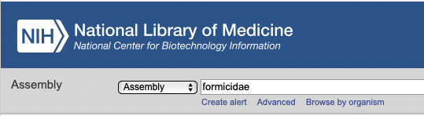
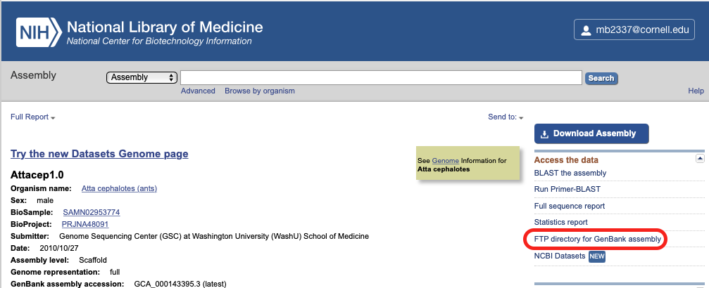

Mentoring in comparative genomics
================
Megan Barkdull

## Introduction

We have two big goals for our time working together:

1.  Running comparative genomics analyses to understand how genes
    related to traits we are interested are evolving across ants.
2.  To learn the computational and bioinformatic skills that will make
    those analyses possible.

## Getting started with Bash

You will be using a lot of different programs in your project:
Orthofinder, BUSTED-PH, RELAX, and maybe others. In order to use those
tools effectively, you’ll need to become comfortable with Bash
scripting. Today, we will practice by working on a script to download
ant genomes.

### Finding genomes to download

We will need to download all the ant genomes we can find, in order to
use them in our comparative genomic analyses. That means we need to find
them in publically available repositories, like the NCBI databases.

It’s important to understand the kind of data we want here. What we’re
looking for probably won’t be referred to as a “genome”- that would be
the sequence of all the DNA in an organism, both coding DNA that can be
translated to proteins, and noncoding DNA. We only want gene sequences
for our project, so we’ll be looking for things like “official gene
sets” or “CDS sequences”. We can find these datasets through the [NCBI
Assembly database](https://www.ncbi.nlm.nih.gov/assembly/).



<details>

<summary>When you search for ant (Formicidae) assemblies, how many
results do you get?</summary>

You should get 78 results.

</details>

### Manual downloading vs. scripting

Now, we could click through and download all of these by hand. However,
that would be both (1) REALLY tedious and (2) Not reproducible- we would
have no record of what exactly we downloaded, and the search results
might change in the future\! So, writing a Bash script is going to be a
better approach.

### How to download files with Bash commands?

One of the most important skills in coding is understanding how to find
help when you need it- that means lots of Googling and consulting with
sites like StackOverflow. When I’m deep in a coding project, I probably
do this tens to hundreds of times a day\! We’ll start practicing that
now.

<details>

<summary>Using Google, what do you think is the Bash command to download
a file from the Internet?</summary>

##### Downloading files

I usually use the command `wget`, which is a free utility for
non-interactive download of files from the Web.

The syntax for `wget` is `wget [options] [url of the file you want to
download]`.

One option you’ll probably want to use is `-O`, which allows you to
specify the filename that you want to save your download to.

Learn more
[here](https://www.shell-tips.com/bash/download-files-from-shell/#gsc.tab=0).

</details>

<details>

<summary>Let’s practice.</summary>

##### Downloading a file

From the command line, what happens if you run the code `wget
https://www.moreaulab.entomology.cornell.edu/files/2022/09/Moreau-Lab-Fall-2022-1536x850.png`?

</details>

<details>

<summary>How would you download that file to a specific name?</summary>

##### Downloading a file

You should use the code `wget -O moreaulab.png
https://www.moreaulab.entomology.cornell.edu/files/2022/09/Moreau-Lab-Fall-2022-1536x850.png`.

</details>

##### Finding URLs for genome assemblies

So clearly, to download files with Bash commands, we need to know the
URL of that particular file online. Luckily, NCBI will supply this for
you\! On the page for a particular genome assembly, look for the link
“FTP directory for RefSeq Assembly” (the best version of the assembly,
but not all species have this) or “FTP directory for GenBank Assembly”.



<details>

<summary>After clicking that link, which of the files do you think we
want to download?</summary>

Ideally, we want the file that has “cds” in the filename, something like
`GCF_003672135.1_Obir_v5.4_cds_from_genomic.fna.gz`.

Not all species will have this; sometimes that means we’ll have to poke
around for a different file, and something that means the genes for a
species aren’t publically available yet, so we won’t use it in our
project.

So, if you right-click and copy the link for the dataset that we want,
we can download it with `wget`.

</details>

<details>

<summary>What code will you use to download a genome and send it to a
specific filename? What happens when you run it?</summary>

Your code should look like `wget -O genome.fna.gz
https://ftp.ncbi.nlm.nih.gov/genomes/all/GCF/003/672/135/GCF_003672135.1_Obir_v5.4/GCF_003672135.1_Obir_v5.4_cds_from_genomic.fna.gz`

When you run that code, you’ll get a file called `genome.fna.gz` in your
working directory, containing gene sequences for your species\!

</details>

### Turning Bash commands into Bash scripts

Now, we could run `wget` 78 times for all the ant genome assemblies on
NBCI, but that would be just as inefficient, error-prone and
nonreproducible as clicking a button. What we need to do is turn our
simple `wget` command into a Bash script, which we can use any time we
want to download a batch of genomes.

#### Writing a simple script

Writing a Bash script is pretty straightforward\! All you need is a text
editor and an idea of what you want your script to do. For text editors,
I really like [Atom](https://github.com/atom/atom/releases/tag/v1.60.0),
which you can download now.

Once you have Atom or another text editor installed and opened up, we
can start writing our script. The first line of every Bash script must
be `#!/bin/bash`. This tells your computer where to find the program,
Bash, which it will use to run the instructions in your script.

After that, you can add whatever code and comments you want to your
script. Let’s start with something simple:

    #!/bin/bash
    
    echo "Hello World"

Add this to your script file, and save it with the name `helloScript`.

Now, before we can run our script, we have to make it “executable”. This
just means giving the computer permission to “execute”, or run, the
contents of the file. We can do this with the command `chmod u+rwx
helloScript`. You can learn more about the `chmod` command
[here](https://www.computerhope.com/unix/uchmod.htm), if you’re
interested.

Now, we can run our script and see what happens\! On the command line,
just type the path to and name of our script: `./helloWorld`.

  - The `./` means the script file is located in our current, working
    directory.
  - `helloWorld` is, of course, the name of the script file.

<details>

<summary>What output do you get when you run the helloWorld
script?</summary>

The shell should print out `Hello World`.

</details>

So this shows us that `echo` is a Bash command that prints out text, in
this case the text “Hello World”.

#### Writing a script to download genomes

We’ve got a basic script that prints the text “Hello world”. Now let’s
make something a little more useful:

1.  Open a new file in Atom
2.  Add the required first line for a Bash script, `#!/bin/bash`
3.  Save it with a meaningful name that tells you what the script does
4.  Via the command line, make the script executable with `chmod`

When writing a script, I think it’s easiest to start small and then
build big. In other words, start with the most simple version of the
task you want to accomplish: in this case, downloading a bunch of
genomes.

<details>

<summary>What’s the simplest version of this task, in words and in
code?</summary>

Downloading just **one** genome is the simplest version of downloading a
bunch of genomes.

The code for this would be something like what we did before: `wget -O
genome.fna.gz
https://ftp.ncbi.nlm.nih.gov/genomes/all/GCF/003/672/135/GCF_003672135.1_Obir_v5.4/GCF_003672135.1_Obir_v5.4_cds_from_genomic.fna.gz`

</details>

#### Doing the same task many times, with Bash

Once we’ve written the code for a mini-version of our bigger task, we
can build up. Now that we know how to download one genome, we can think
about how to download several genomes.

Often a really good way to do this with Bash code is with something
called a **loop**. Loops let us take a series of commands and keep
re-running them until a particular condition is reached. They are useful
for automating repetitive tasks.

<details>

<summary>What different kind of loop exist in Bash? Use Google to find
an answer.</summary>

Bash has three basic kinds of loops: 1. For loops 2. While loops 3.
Until loops

Each loop is different because it will stop running based on a different
kind of final condition.

</details>

Loops will run over and over until a final condition is satisfied.

<details>

<summary>What final conditions satisfy each kind of loop? Use Google to
find an answer.</summary>

1.  For loops run code **for** each element of a list, and stop once
    there are no list elements remaining.

<!-- end list -->

``` bash
  # Create a list of names
  names='Mahalia Megan Seyde'
  # For each name in the list
  for name in $names
  # Print the name
  do
  echo $name
  done
  echo All done
```

``` 
  ## Mahalia
  ## Megan
  ## Seyde
  ## All done
```

2.  While loops run code **while** some condition remains TRUE. For
    example, keep printing numbers, starting at zero, as long as the
    last number you printed is less than ten.

<!-- end list -->

``` bash
  # Start a counter at 1
  counter=1
  # While the counter is less than or equal to 10 (that's what -le means)
  while [ $counter -le 10 ]
  do
  # Tell us the current value of the counter
  echo $counter
  # And increase the value of the counter by 1
  ((counter++))
  done
  echo All done
```

``` 
  ## 1
  ## 2
  ## 3
  ## 4
  ## 5
  ## 6
  ## 7
  ## 8
  ## 9
  ## 10
  ## All done
```

3.  Until loops run code **UNTIL** some condition becomes TRUE. For
    example, keep printing numbers, starting at zero, until the last
    number you printed is equal to ten.

<!-- end list -->

``` bash
  # Start a counter at 1
  counter=1
  # Until the counter is greater than 10,
  until [ $counter -gt 10 ]
  do
  # Print the current counter value
  echo $counter
  # And increase the counter value by 1. 
  ((counter++))
  done
  echo All done
```

``` 
  ## 1
  ## 2
  ## 3
  ## 4
  ## 5
  ## 6
  ## 7
  ## 8
  ## 9
  ## 10
  ## All done
```

</details>

We want to download a whole bunch of genome assemblies using `wget`.
What kind of loop do you think makes the most sense here? Think about
their conditions.

<details>

<summary>What kind of loop could we use to download our
genomes?</summary>

I would use a for loop. I can’t think of a logical TRUE/FALSE condition
to give to a while or until loop, but we could use a for loop to iterate
over a list of genomes\!

</details>
